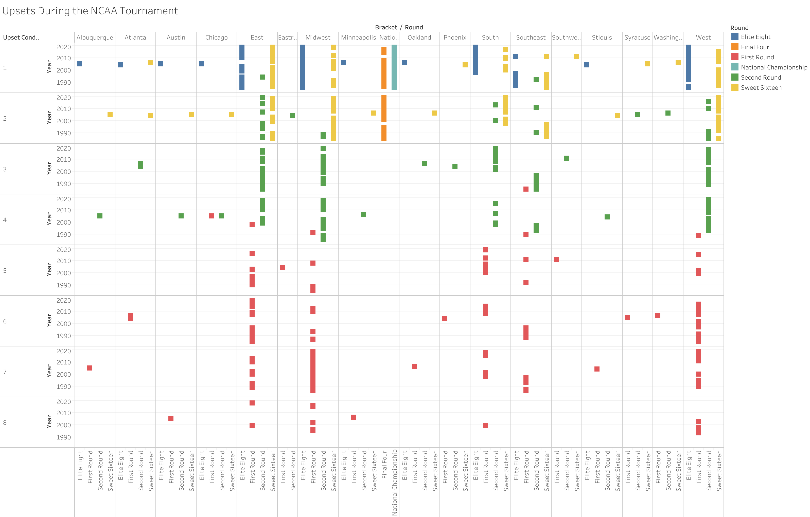
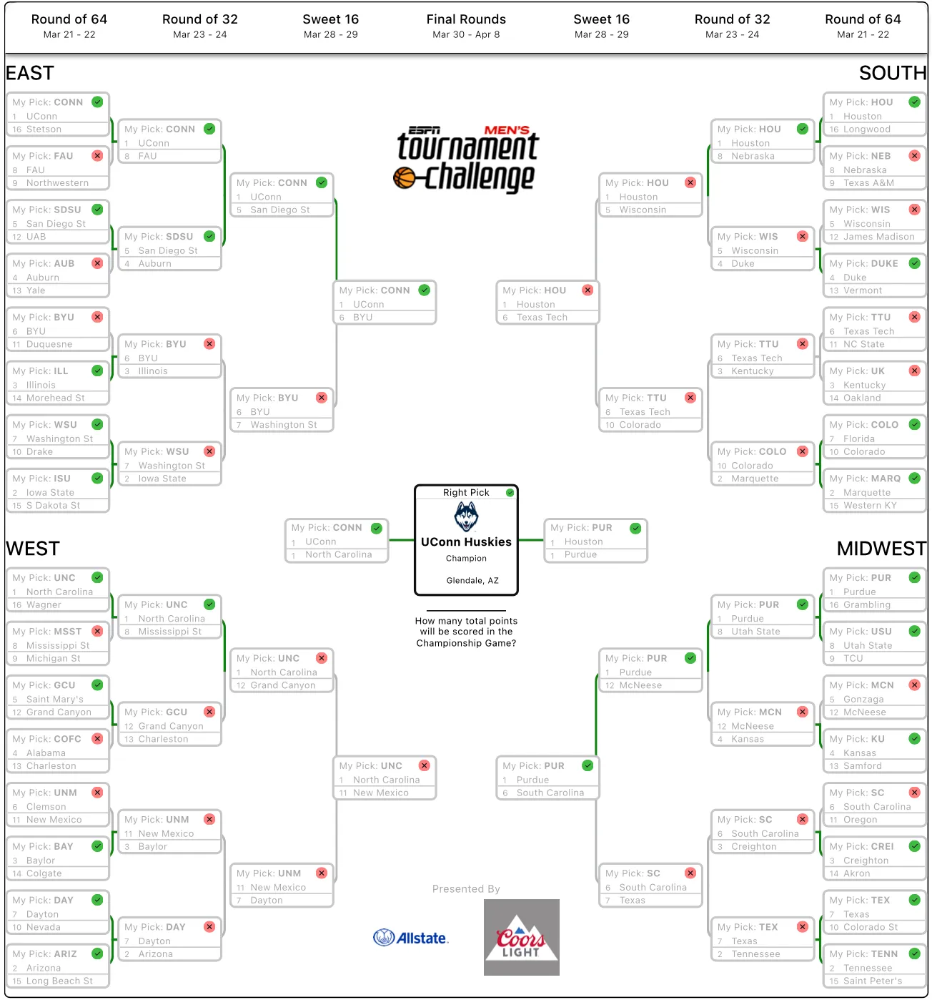

# Predicting the 2024 March Madness Bracket using an Adaboost Machine Learning Model

## Background 🚀
As March Madness approaches each year, college basketball fans eagerly wait for the bracket to be released so that they can theorize and create bracket predictions of their own. Of course, there are many ways to create a bracket. You can base it off of gut feeling, expert opinions, team colors, or randomization. However, I wanted to explore whether or not I could use past and previous statistics to determine the outcome of this year’s tournament.

## Tech Stack 📚
For the following project, I used: **Python, scikit-learn, Pandas, and Tableau**.

## Process 🔀
1. Collect past tournament and season data (up until 1985).
2. Explore the data and engineer the features required. This includes creating dummy variables.
3. Create a model to use and test said model.
4. Collect this years bracket and season data.
5. Iteratively run the model for each round (game-by-game).
6. Evaluate and display results.

## Data Collection 💾
To collect my data, I used web scraping to retrieve information from [sports-reference.com](https://www.sports-reference.com/cbb/). Of course, to do so ethically and to relieve any potential load on the website’s end, I web scraped in batches and with time breaks in between.

## Data Exploration 🔎
While exploring the data, the biggest thing that I wanted to explore was how certain factors affected the likelihood of upsets. Of course, it’s easy for the algorithm to detect high performers through past performance, but upsets tend to be a little more random. I used the following Tableau visualization to do so. In the end, however, I did not end up actually creating any features to represent upset probability. The Tableau visualization can be found here.

## Model Creation 💡
For the actual model, I decided to use an AdaBoost Classifier with ***18 decision trees*** as the weak learners. Ultimately, this performed quite well given the features that I engineered. It resulted in an accuracy score of ***82%*** amongst the test data.

## Results 🎯
The results of my algorithm’s predictions were used to create the following bracket.

In the end, it’s clear to see that my bracket only picked based on the team that was on top in the game listing, whether it was the higher or lower seed. I believe that this error is due to my method of engineering the features. Regardless, potentially due to sheer luck, this bracket performed quite well and correctly picked the national championship matchup and the winner.

## Next Steps ➡️
In the upcoming years, I would like to explore various other models and other features to base the predictions on. Furthermore, I would like to improve my data engineering process in order to encode the region, location, and round in a better way. I also want to find ways to engineer various other features that may be important like coach success rate, likelihood of upset, past cinderella runs, etc.

## Source Code 👨‍💻
If you are interested in finding the source code for the above process, you can find it [here](https://github.com/vibindi/march-madness-predictor-v1/tree/main).
